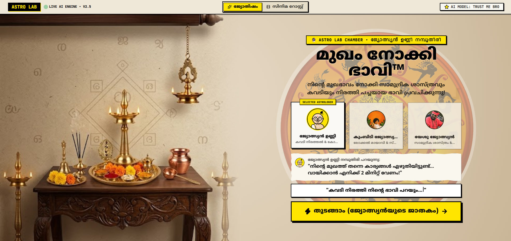
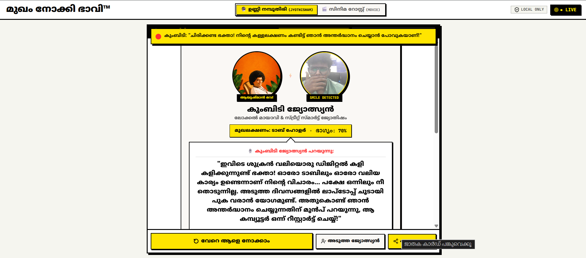
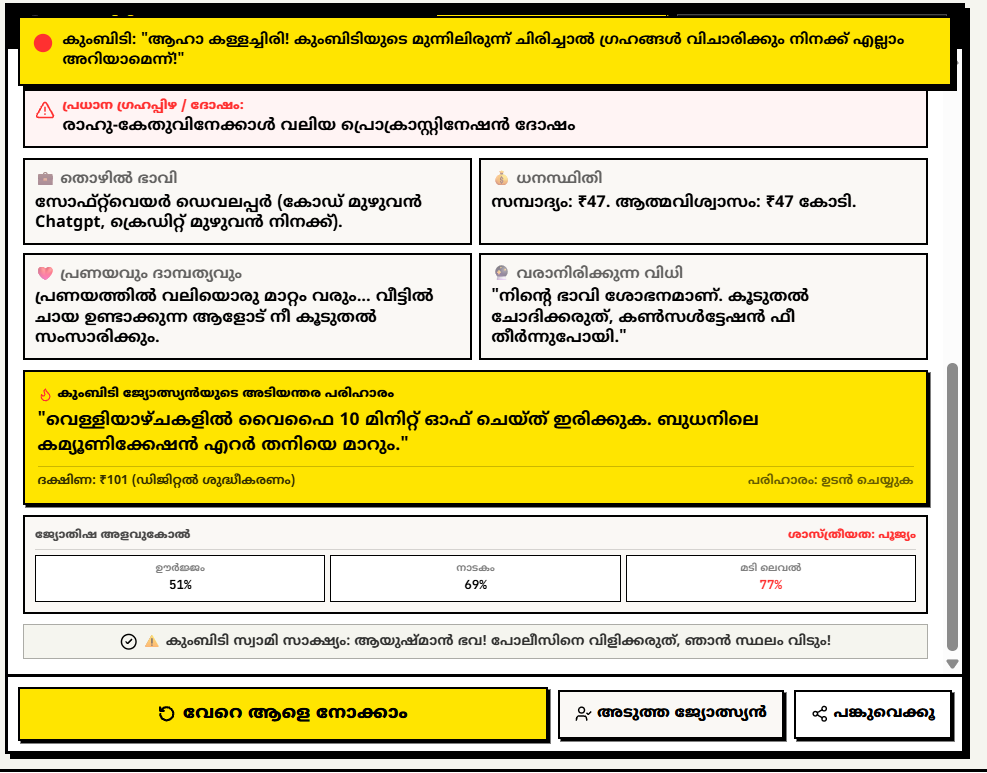
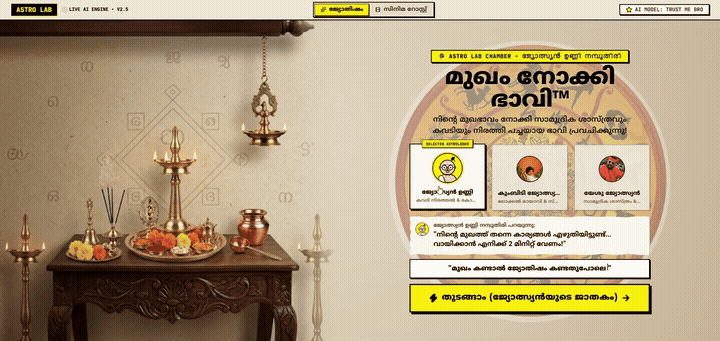

# Astro Lab 🎯

## Basic Details

### Team Name: Hublot

### Team Members
- **Team Lead:** SHAMILA - JCET
- **Member 2:** SOORAJ K - JCET
- **Member 3:** AKSHAY V - JCET

---

## Project Description

**Astro Lab (മുഖം നോക്കി ഭാവി™)** is an interactive computer-vision experiment that combines real-time facial expression analysis with satirical Malayalam pop-culture astrology. Using on-device face mesh detection, it scans your expressions, calculates your cosmic face archetype, and unleashes hilarious prophecies and absurd remedies (*പരിഹാരങ്ങൾ*) through legendary comedic astrologers.

---

## The Problem (that doesn't exist)

People are wasting hundreds of rupees visiting traditional astrologers to find out why their lives are in shambles, only to be told that Saturn (ശനി) is having fun in their 7th house. Worse, nobody has an instant way to get roasted by an astrologer directly through their webcam without leaving their bedroom.

---

## The Solution (that nobody asked for)

Astro Lab turns your webcam into an authentic Kerala astrology chamber (*ജ്യോതിഷാലയം*). Powered by Google MediaPipe's neural face mesh running at 60 FPS in the browser, Astro Lab scans your micro-expressions, diagnoses made-up cosmic afflictions (*ദോഷങ്ങൾ*), and lets iconic astrologer personas (Jyothisyan Unni Namboothiri, Kumbidi, and Yeshu) demand ridiculous penances and Google Pay dakshina—with zero scientific backing but 100% confidence.

---

## Technical Details

### Technologies/Components Used

#### For Software:
- **Languages used:** TypeScript, JavaScript, HTML5, CSS3
- **Frameworks used:** React 19, Vite
- **Libraries used:** 
  - `@mediapipe/tasks-vision` (Google MediaPipe 468 3D Landmarks & 52 Blendshapes)
  - `zustand` (State Management)
  - `tailwindcss` (Neo-Brutalist Kerala Altar Styling)
  - `lucide-react` (Icons)
  - `clsx`, `tailwind-merge`
- **Tools used:** VS Code, Vite Dev Server, Oxlint, Git, GitHub

#### For Hardware:
*(Note: Astro Lab is a purely software-based web application; no custom hardware required.)*
- **Main components:** Standard Webcam / Mobile Camera, Audio Output (Speakers / Headphones)
- **Specifications:** Any modern WebRTC-compatible browser (Chrome, Edge, Safari, Firefox)
- **Tools required:** Laptop, Desktop, or Smartphone with camera access

---

## Implementation

### For Software:

#### Installation
```bash
git clone https://github.com/sooraj20-dev/Astro_labs.git
cd Astro_labs
npm install
```

#### Run
```bash
npm run dev
```
Open `http://localhost:5173` in your browser and grant camera access when prompted.

---

## Project Documentation

### For Software:

#### Screenshots (Add at least 3)
  
*Screenshot 1: The Antique Kerala Altar Chamber featuring live Astrologer selection (Unni Namboothiri, Kumbidi, Yeshu) and the rotating cosmic zodiac wheel.*

  
*Screenshot 2: Real-time computer vision analysis tracking facial landmarks, smile detection, face archetype ("ടാബ് ഹോൾഡർ"), and Kumbidi's custom prophecy.*

  
*Screenshot 3: Official Jathakam Verdict Card displaying humorous doshams ("പ്രൊക്രാസ്റ്റിനേഷൻ ദോഷം"), career/wealth forecasts, and absurd pariharams.*

#### Diagrams
```
┌─────────────────┐       ┌────────────────────────┐       ┌────────────────────────┐
│  Webcam Stream  │ ───>  │  MediaPipe Face Mesh   │ ───>  │  Expression Classifier │
│  (60 FPS Local) │       │  (468 Mesh + 52 Blend) │       │  (Smirk/Laughter/Mood) │
└─────────────────┘       └────────────────────────┘       └───────────┬────────────┘
                                                                       │
┌─────────────────┐       ┌────────────────────────┐                   │
│ Shareable Card  │ <───  │ Procedural Jyothisham  │ <─────────────────┘
│  & Web Audio    │       │ (Dosham & Pariharams)  │
└─────────────────┘       └────────────────────────┘
```
*Workflow Diagram: End-to-end client-side pipeline from local video stream to neural landmark evaluation, astrological generation, Malayalam audio reactions, and canvas export.*

---


## Project Demo

### Video



🎬 **[Watch / Download Demo Video (Fast-Streaming MP4)](src/assets/Astro/outputs/demo.mp4)**  
*(Also available in [Original HD Format](src/assets/Astro/outputs/op.mp4))*

*The video demonstrates entering the Astro Lab chamber, selecting an astrologer, running live facial landmark detection, triggering voice lines, and generating the customized Jathakam verdict.*

### Additional Demos
- **Live Demo Link:** [Add your live deployment link here]

---

## Team Contributions
- **SHAMILA:** Mentoring
- **SOORAJ K:** Project ideation, UX/UI theme design (Neo-Brutalist Kerala altar aesthetic), content copywriting for Malayalam astrologer prophecies and pariharams.Core computer vision integration with Google MediaPipe, real-time landmark/blendshape classifier algorithms, and React architecture.
- **AKSHAY V:** Audio engine integration with Web Audio API, canvas card generation for social sharing, responsive layout optimization, and testing.

---

Made with ❤️ at TinkerHub Useless Projects


